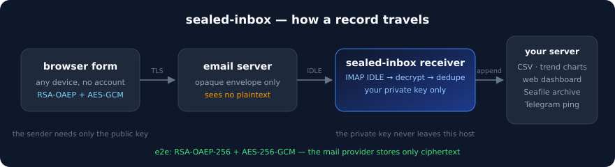

English | [简体中文](README.zh-CN.md) | LLM-friendly overview: [llms.txt](llms.txt)

# sealed-inbox

> **Your health records belong to you.** Log them from any browser,
> store them on your own server — and your mail provider never reads
> a single word.

A self-hosted receiver for **end-to-end encrypted personal records** sent
over plain email. Any device with a web browser can be the sender; the
receiver runs on a Linux box, a Termux phone, or inside a container.



Also see [`frontend/`](frontend/) — the source of the sender web page
(drop-in replacement for the deployed `secure-relay-fast-v4.html`), and
[`deploy/`](deploy/) for the sanitized production deployment recipes
(Termux: cloudflared tunnel, boot autostart, Telegram URL-watch).

The wire format is the production v4 format produced by
`secure-relay-fast-v4.html` (and any conforming sender). The email
server only ever sees an opaque envelope; the receiver verifies the
contents, appends to a CSV, and (optionally) regenerates charts and
uploads to Seafile.

## What this repo ships

| File | Purpose |
|---|---|
| `src/envelope.py` | v4 envelope parser, RSA-OAEP + AES-256-GCM decrypt |
| `src/sender.py` | Reference sender + setup CLI (`generate`, `new-kid`) — builds valid envelopes |
| `src/pipeline.py` | One-shot receiver: fetch, decrypt, append CSV, regenerate charts, archive |
| `src/watcher.py` | IMAP IDLE long-running watcher (event-driven, < 1 s wake-up) |
| `src/charts.py` | Matplotlib rolling-window chart renderer |
| `src/seafile_upload.py` | Seafile Web API upload (overwrite mode) |
| `src/config.py` | YAML config loader, secrets stay out of source |
| `src/dashboard.py` | Zero-dependency local web dashboard: readings, trend charts, status, login audit |
| `tests/test_t1_v4_compat.py` | T1: sender ↔ this receiver ↔ production receiver all agree |
| `tests/test_t2_real_email.py` | T2: multipart / Formspree-style / HTML-escaped JSON / Chinese text |
| `tests/test_t3_dedupe.py` | T3: same IMAP UID twice → exactly one CSV row |
| `tests/test_t4_watcher_idle.py` | T4: hand-rolled IMAP IDLE, no `mail.idle()` calls |
| `tests/test_t5_no_pii.py` | T5: zero personal / production strings in the repo |
| `tests/test_t6_dashboard.py` | T6: dashboard auth flow, session cookie, chart-path sandbox, rate limiting |
| `tests/test_t7_demo.py` | T7: demo mode builds a throwaway workspace and serves it |
| `tests/test_t8_security.py` | T8: CSV formula-injection guard, strict MAC auth, freshness window |
| `docs/PROTOCOL.md` | Complete wire-format spec (v1) — enough to build a sender |
| `config.example.yaml` | Configuration template |

## Quick start (Debian / Ubuntu / proot-distro)

Requirements: Python 3.10+ (tested on 3.13), `cryptography`, `PyYAML`,
`matplotlib` (only for the charts).

```bash
sudo apt install python3 python3-pip python3-cryptography python3-matplotlib python3-yaml
git clone https://github.com/<you>/sealed-inbox.git
cd sealed-inbox
cp config.example.yaml config.yaml
$EDITOR config.yaml                       # fill in imap.username; see the next section

# One-time setup: receiver keypair + a kid secret for your sender.
python3 -m src.sender generate keys       # → keys/record_decrypt_private.pem (never share)
                                          # → keys/record_encrypt_public.pem  (for the sender)
python3 -m src.sender new-kid phone-form  # → kid_secrets.json; prints the secret once

# Drop an app password into a file (NOT your real account password).
echo 'abcd efgh ijkl mnop' > ~/.config/secure-record/imap-app-password

# Dashboard access password (separate secret, also git-ignored).
echo 'my-dashboard-secret' > ~/.config/secure-record/dashboard-access-key

# Verify the install (all offline).
python3 -m tests.test_t1_v4_compat
python3 -m tests.test_t2_real_email
python3 -m tests.test_t3_dedupe
python3 -m tests.test_t4_watcher_idle
python3 -m tests.test_t5_no_pii
python3 -m tests.test_t6_dashboard
python3 -m tests.test_t7_demo
python3 -m tests.test_t8_security

# Run the pipeline once, or as a long-lived IMAP IDLE watcher.
python3 -m src.pipeline
python3 -m src.watcher &

# Optional: local web dashboard (readings, charts, status).
python3 -m src.dashboard
```

On Termux: `pkg install python python-cryptography python-matplotlib python-yaml`.

## Connect your sender

The reference frontend is the already-published
`secure-relay-fast` web page (works from any browser, no install).
Four fields connect it to this receiver:

| Web-form field (Chinese UI) | Value |
|---|---|
| 公钥 PEM *(public key PEM)* | contents of `keys/record_encrypt_public.pem` |
| 密钥 ID (kid) *(key ID)* | e.g. `phone-form` — anything you chose in `new-kid` |
| 授权密钥 *(auth token)* | the secret printed by `new-kid` (re-read it from `kid_secrets.json`) |
| 收件邮箱 *(recipient)* | the same address as `imap.username` in `config.yaml` |

Also make sure the form's **主题前缀** *(subject prefix)* equals
`imap.subject_prefix` in `config.yaml` (the frontend default
`[OpenClaw Secure Record]` matches the shipped example config). Send
one test record, then:

```bash
python3 -m src.pipeline      # fetch + decrypt + append
cat data/records.csv         # your record should be the last row
```

The default form has a blood-glucose field set (glucose_value) and an
accounting one (amount); both land in the same CSV — see
`docs/PROTOCOL.md` for the exact inner-record columns.

## Running it for real

**Linux server** — a minimal systemd unit:

```ini
# /etc/systemd/system/sealed-inbox-watcher.service
[Unit]
Description=sealed-inbox IMAP IDLE watcher
After=network-online.target

[Service]
WorkingDirectory=/opt/sealed-inbox
ExecStart=/usr/bin/python3 -m src.watcher
Restart=always
RestartSec=10

[Install]
WantedBy=multi-user.target
```

**Termux** — keep the phone awake and start on boot:

```bash
termux-wake-lock
python3 -m src.watcher      # add to ~/.bashrc or a Termux:Boot script
```

The watcher reconnects with exponential backoff and re-enters IMAP
IDLE every 25 minutes (Gmail drops longer IDLEs); the pipeline runs as
a subprocess whenever new matching mail arrives.

## View your data (dashboard)

Want a 60-second taste first? `python3 -m src.demo` spins up a
throwaway workspace with two weeks of fake glucose readings, renders
the charts and serves the dashboard — nothing touches your real
config, and Ctrl-C throws it all away.

`python3 -m src.dashboard` serves a mobile-friendly, zero-dependency
web page on the configured port (default `0.0.0.0:8086`): latest
readings with colour-coded values, the trend-chart PNGs, watcher
status, log tails and a login audit. It authenticates with the access
key from `dashboard.access_key_file`: the POST login form sets a 7-day
HMAC session cookie. The password is **never accepted in a URL** (it
would end up in browser history and tunnel logs). Chart files are
served **only** from `charts_dir` — path traversal is tested against
in T6.

Reaching it from your phone:

* **LAN** — `http://<device-ip>:8086` while on the same network.
* **Tailscale** — keeps it fully private; point the app at the
  device's tailnet IP.
* **cloudflared** — `cloudflared tunnel --url http://localhost:8086`
  gives you a public HTTPS URL; put the tunnel behind the dashboard
  access key. Named tunnels give you a stable hostname.

Honest limits, and the controls that now exist for them:

* **Plain HTTP** — TLS terminates at your tunnel (cloudflared) or
  nowhere; otherwise keep it on the LAN.
* **Password guessing** — the POST login is rate-limited per IP
  (`dashboard.rate_limit_max` failures within `rate_limit_window`
  seconds → 429 lockout; defaults 10 / 300 s). Login bodies larger
  than 64 KB are refused.
* **Sender authentication** — the envelope `mac` is not verified by
  default (production parity): anyone holding the RSA public key can
  submit under any kid label. The reference frontend already signs
  every record, so setting `crypto.require_valid_mac: true` upgrades
  this to real sender authentication at zero cost to the sender —
  unknown kids and bad signatures are then rejected.
* **Replay** — `crypto.max_age_hours` (e.g. `48`) rejects records whose
  `ts` is older than that; default off (production parity).
* **Spreadsheet injection** — CSV cells starting with `= + - @` are
  quote-prefixed, so opening `records.csv` in Excel executes nothing.
* Keep the access key long and rotate it (and the RSA keypair) if
  either leaks.

## Configuration

The whole project is driven by `config.yaml`. See `config.example.yaml`
for every key. Notable fields:

* `imap.username` + `imap.app_password_file` — use a provider *app
  password*, not your real password. The file's contents are read at
  startup and never written to disk or logs.
* `crypto.private_key_path` — RSA-2048 PEM, generated by
  `python3 -m src.sender generate keys`.
* `crypto.kid_secrets_path` — JSON file mapping `kid → {secret, enabled}`.
  This file is read-only on the receiver. The kid secret is used by the
  sender to bind records to a kid via HMAC; the receiver does not verify
  the HMAC, matching the production v2 behaviour.
* `storage.archive.backend` — `"local"` (no upload) or `"seafile"`.
* `storage.state_path` / `idle_state_path` — JSON files for
  per-message dedup (IMAP SEARCH ids, same scheme as production) and
  watcher state respectively.
* `charts.windows` — list of rolling windows (`24h`, `48h`, `7d`, `30d`).
* `dashboard.*` — bind address/port, `access_key_file` (git-ignored),
  reading colour thresholds (`low`/`high`), the watcher `pgrep`
  pattern and optional log tails for the web page.

The private key and any token files are git-ignored.

## How the wire format works

See [`docs/PROTOCOL.md`](docs/PROTOCOL.md). The short version:

```
OPENCLAW_SECURE_RECORD_V1
{
  "v": 1,
  "kid": "<kid string>",
  "ts": <ms since epoch>,
  "nonce": "<base64url 16 bytes>",
  "alg": "RSA-OAEP-SHA256+AES-256-GCM",
  "ek":   "<base64url RSA-OAEP encrypted AES-256 key>",
  "iv":   "<base64url 12-byte AES-GCM nonce>",
  "ct":   "<base64url ciphertext || 16-byte GCM tag>",
  "mac":  "<base64url HMAC-SHA256(kid_secret, [1,kid,ts,nonce,ek,iv,ct].join('|'))>"
}
```

The receiver also accepts the alias marker `HERMES_SECURE_RECORD_V1`.

## Security properties

* The email server only ever sees an opaque envelope. There is no
  plaintext leak via subject lines or headers.
* AES-GCM authenticates the record; tampering is rejected with
  `AES-GCM authentication failed`.
* The kid secret is computed by the sender and recorded in the
  envelope; **the receiver does not verify it and does not filter by
  kid** (matching production v2). Practical consequence: anyone holding
  the RSA public key can submit a record under any kid label — treat
  the public key itself as the submission capability, and rotate it if
  it leaks.
* The private key never leaves the receiver host. Senders only ever see
  the public key.

## Tests

```
$ for t in test_t1_v4_compat test_t2_real_email test_t3_dedupe \
           test_t4_watcher_idle test_t5_no_pii test_t6_dashboard; \
  do python3 -m "tests.$t" || break; done
T1 PASS
T2 PASS
T3 PASS
T4 PASS
T5 PASS
T6 PASS
T7 PASS
T8 PASS
```

The test suite is fully offline:

* T1 generates a fresh keypair, builds a v4 envelope, and asserts the
  same inner record is returned by *both* this repo's receiver *and* a
  reference production receiver. The reference is loaded read-only
  from the path in `$PROD_RECEIVER_PATH` (default: unset — the oracle
  part skips cleanly, e.g. in CI; the file is never modified).
* T2 builds a real `multipart/alternative` message with HTML-escaped
  JSON (Formspree's reality) and exercises the receiver's email parser.
* T3 runs the pipeline three times against a mock IMAP server and
  confirms the CSV never grows on a re-run with the same UID.
* T4 inspects the watcher source to confirm it does NOT call
  `mail.idle()`, then drives a real IDLE cycle with a fake IMAP.
* T5 greps the working tree for generic accident patterns (real email
  addresses, tunnel URLs, chat ids, PEM key blocks, absolute Termux
  paths, stray UUIDs) plus, if you provide a git-ignored
  `tests/pii_patterns.local` (`label|regex` per line), your own
  concrete values. It refuses to pass if anything fires.
* T6 starts the real dashboard server on an ephemeral port and
  exercises the auth flow (wrong/right password via POST), asserts
  that a password carried in a URL query string is rejected by
  design, the session cookie, `/api/status`, and that chart requests
  cannot escape `charts_dir` (path traversal → 404).

Want to feed records to the receiver without a mailbox (batch import,
backfill)? T3 contains the recipe: it monkeypatches
`src.pipeline.imaplib.IMAP4_SSL` with an in-process fake and calls
`pipeline.run()` — copy that shim and hand it pre-built envelopes
from `src.sender.build()`.

## Background

This was originally built around a specific web form; the wire
protocol is independent of any single sender frontend. Any sender that
produces a conforming v4 envelope (see `docs/PROTOCOL.md`) will work.

## License

MIT — see `LICENSE`.
